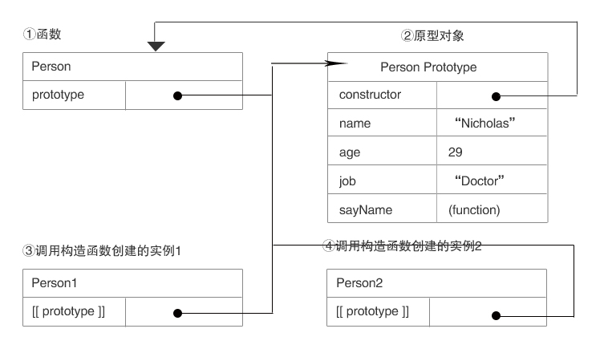

#面向对象的程序设计

###创建对象

1. [工厂模式](#a1)
2. [构造函数模式](#a2)
3. [原型模式](#a3)
4. [组合使用构造函数模式和原型模式](#a4)
5. [动态原型模式](#a5)
6. [寄生构造函数模式](#a6)
7. [稳妥构造函数模式](#a7)
###继承
1. [原型链](#a21)
2. [借用构造函数](#a22)
3. [组合继承](#a23)
4. [原型式继承](#a24)
5. [寄生式继承](#a25)
6. [寄生组合式继承](#a26)

'
***
###一、理解对象（略）

1、属性类型（数据属性，访问器属性）

2、定义多个属性

3、读取属性的特性

###二、创建对象

<h3 id="a1">1、工厂模式</h3>

    function createPerson(name, age, job) {
        var o = new Object();
        o.name = name;
        o.age = age;
        o.job = job;
        o.sayName = function () {
            alert(this.name);
        };
        return o;
    }
    var person1 = createPerson("Nicholas", 29, "Software Engineer");
    var person2 = createPerson("Greg", 27, "Doctor");
    person1.sayName();  //"Nicholas"
    person2.sayName();  //"Greg"
    //    虽然解决了创建多个相似对象的问题，但却没有解决对象识别的问题（即怎样知道一个对象类型）

<h3 id="a2">2、构造函数模式</h3>

没有显示的创建对象；直接将属性和方法赋给了this对象；没有return语句。

    function Person(name, age, job) {
        this.name = name;
        this.age = age;
        this.job = job;
        this.sayName = function () {
            alert(this.name);
        }
    }
    var person1 = new Person("Nicholas", 29, "Software Engineer");
    var person2 = new Person("Greg", 27, "Doctor");
    //        这两个对象都有一个constructor属性，该属性指向Person
    alert(person1.constructor == Person); //true
    alert(person2.constructor == Person); //true
    alert(person1 instanceof Object);  //true
    alert(person1 instanceof Person);  //true
    alert(person2 instanceof Object);  //true
    alert(person2 instanceof Person);  //true
1）将构造函数当做函数

    //    当做构造函数使用
        var person = new Person("Nicholas", 29, "Software Engineer");
        person.sayName(); //"Nicholas"
    //    作为普通函数调用
        Person("Greg",27,"Doctor");  //添加到window
        window.sayName();
    //    在另一个对象的作用域中调用
        var o=new Object();  //"Greg"
        Person.call(o,"Kristen",25,"Nurse");
        o.sayName(); //"Kristen"
2）构造函数的问题：

每个方法都要在实例上创建一遍，每个Person实例都包含一个不同的Function实例。不同实例上的同名函数是不相等的。导致不同的作用域链和标识符的解析。于是，

    function Person(name, age, job) {
        this.name = name;
        this.age = age;
        this.job = job;
        this.sayName = sayName;
    }
    function sayName() {
        alert(this.name);
    }
问题：在全局作用域中定义的函数实际上只能被某个对象调用，这让全局函数有点名不副实。而，如果对象需要定义很多方法，那么就要定义很多个全局函数，于是我们这个自定义的引用类型就丝毫没有封装性可言了。

<h3 id="a3">3、原型模式</h3>

我们创建的每个函数都有一个prototype（原型）属性，这个属性是一个指针，指向一个对象，而这个对象的用途是包含可以由特定类型的所有实例共享的属性和方法。

prototype就是通过调用构造函数而创建的那个对象实例的原型对象。

    function Person() {}
    Person.prototype.name = "Nicholas";
    Person.prototype.age = 29;
    Person.prototype.job = "Software Engineer";
    Person.prototype.sayName = function () {
        alert(this.name);
    }
    var person1 = new Person();
    person1.sayName(); //"Nicholas"
    var person2 = new Person();
    person2.sayName();  //"Nicholas"
    alert(person1.sayName == person2.sayName);  //true
    //    新对象的这些属性和方法是由所有实例共享的
 1）理解原型对象

无论什么时候，只要创建了一个新函数①，就会为该函数创建一个prototype属性，这个属性指向函数的原型对象②。在默认情况下原型对象都会自动获得一个constructor（构造函数属性 ），这个属性包含一个指向prototype属性所在函数的指针。

当调用构造函数创建一个新实例后③④，该实例的内部将包含一个指针（内部属性）[[Prototype]]，指向构造函数的原型对象。注意：这个连接存在于实例与构造函数的原型对象之间，而不是存在于实例与构造函数之间。

isPrototypeOf():确定对象之间是否真的存在[[Prototype]]关系

getPrototypeOf();返回[[Prototype]]的值。支持浏览器有IE9+、Firefox3.5+、Safari 5+、Opera 12+和Chrome

    alert(Person.prototype.isPrototypeOf(person1)); //true
    alert(Person.prototype.isPrototypeOf(person2)); //true

    alert(Object.getPrototypeOf(person1)==Person.prototype); //true
    alert(Object.getPrototypeOf(person1).name); //"Nicholas"
每当对象读取某个对象的某个属性时，都会执行一次搜索。搜索首先从对象实例本身开始，如果在实例中找到了具有给定名字的属性，则返回该属性的值；如果没有找到，则继续搜索指针指向的原型对象，在原型对象中查找具有给定名字的属性。如果在原型对象中找到了这个属性，则返回该属性的值。

alert(Person.prototype.constructor==Person); //true 原型最初只包含constructor属性，而改属性也是共享的，因此可以通过对象实例访问。如：

alert(person1.constructor==Person); //true

注意：虽然可以通过实例访问保存在原型中的值，但却不能通过对象实例重写原型中的值。如果在对象实例创建一个同名属性，将会屏蔽原型中的值。

    function Person() {}
    Person.prototype.name = "Nicholas";
    Person.prototype.age = 29;
    Person.prototype.job = "Software Engineer";
    Person.prototype.sayName = function () {
        alert(this.name);
    }
    var person1 = new Person();
    var person2 = new Person();

    person1.name="Greg";
    alert(person1.name); //"Greg"——来自实例
    alert(person1.hasOwnProperty("name")); //true
    alert(person2.name); //"Nicholas"——来自原型
    alert(person2.hasOwnProperty("name")); //false

    delete person1.name;
    alert(person1.name); //"Nicholas"——来自原型
    alert(person1.hasOwnProperty("name")); //false
    //    hasOwnProperty()可以检测一个属性是存在于实例中，还是存在于原型中。这个方法从Object继承而来，只在属性存在于对象实例中时，才会返回true。

2）原型与in操作符

有两种方式使用in操作符：单独使用和在for-in循环中使用。在单独使用时，in操作符会在通过对象能够访问给定属性时返回ture，无论该属性存在于实例中还是原型中。

    alert("name" in person1);  //true ——来自原型
    alert(hasPrototyepProperty(person1,"name")); //true——来自原型
    person1.name = "Greg";
    alert("name" in  person1); //true ——来自实例
    alert(hasPrototyepProperty(person1,"name")); //false ——来自实例
    //    判断属性是原型中的属性
    function hasPrototyepProperty(object, name) {
        return !object.hasOwnProperty(name) && (name in object);
    }
3）更简单的原型语法

    function Person() {
    }
    Person.prototype={
       name:"Nicholas",
       age:29,
       job:"Software Engineer",
       sayName:function(){
           alert(this.name);
       }
    }
    //    我们将Person.prototype设置为等于一个以对象字面量形式创建的新对象
    //    导致的问题
    var friend=new Person();
    alert(friend instanceof Person); //true
    alert(friend.constructor==Person); //false  实例的constructor属性不再指向Person了
4）原型的动态性

    function Person() {
    }
    //    情况一：
    var friend = new Person();
    Person.prototype.sayHi = function () {
        alert("Hi");
    }
    friend.sayHi();  //"Hi" (没问题)
    //    情况二：
    var friend1 = new Person();
    Person.prototype = {
        constructor: Person,
        name: "Nicholas",
        age: 29,
        job: "Software Engineer",
        sayName: function () {
            alert(this.name);
        }
    }
    friend1.sayName(); //error  TypeError: friend1.sayName is not a function
    //    重写原型切断了现有原型与任何之前已经存在的对象实例之间的联系；它们引用的仍然是最初的原型
5）原生对象的原型。

原型模式的重要性不仅体现在创建自定义类型方面，就连所有原生的引用类型，都是采用这种模式创建的。

        alert(typeof Array.prototype.sort);  //function
        alert(typeof String.prototype.substring); //function
    //    通过原生对象的原型，不仅可以取得所有默认方法的引用，而且也可以定义新方法。可以像修改自定义对象的原型一样修改原生对象的原型。
        String.prototype.starWith=function(text){
            return this.indexOf(text)==0;
        }
        var msg="Hello world!";
        alert(msg.starWith("Hello")); //true
        alert(msg.starWith("llo")); //false
不推荐修改原生对象的原型。导致命名冲突，而且，可能会意外地重写原生方法。

6）原型对象的问题

①所有实例在默认情况下都将取得相同搞的属性值。

②原型中的所有属性是被很多实例共享的，对于包含基本值的属性倒可添加同名属性覆盖。但，对于包含引用类型值的属性来说，使得实例不能拥有属于自己的全部属性。

    function Person(){
    
    }
    Person.prototype={
        constructor:Person,
        name:"Nicholas",
        age:29,
        friends:["Shelby","Court"],
        sayName:function(){
            alert(this.name);
        }
    }
    var person1=new Person();
    var person2=new Person();
    person1.age=20;  //重置基本值的属性
    person1.friends.push("Van"); //修改引用的数组
    alert(person1.age); //20
    alert(person2.age); //29
    alert(person1.friends); //"Shelby,Court,Van"
    alert(person2.friends); //"Shelby,Court,Van"
    alert(person1.friends===person2.friends);  //true
<h3 id="a4">4、组合使用构造函数模式和原型模式</h3>

    function Person(name, age, job) {
        this.name = name;
        this.age = age;
        this.job = job;
        this.firend = ["Shelby", "Court"];
    }
    Person.prototype = {
        constructor: Person,
        sayName: function () {
            alert(this.name);
        }
    }
    var person1 = new Person("Nicholas", 29, "Software Engineer");
    var person2 = new Person("Greg", 27, "Doctor");
    person1.firend.push("Van");
    alert(person1.firend); //"Shelby,Court,Van"
    alert(person2.firend); //"Shelby,Court"
    alert(person1.firend === person2.firend); //false
    alert(person1.sayName === person2.sayName); //true

<h3 id="a5">5、动态原型模式</h3>  page159
<h3 id="a6">6、寄生构造函数模式</h3>
<h3 id="a7">7、稳妥构造函数模式</h3>

###三、继承

许多OO语言都支持两种继承方式：接口继承和实现继承。接口继承只继承方法签名，而实现继承则继承实际的方法。由于函数没有签名，在ECMAScript中无法实现接口接触。ECMAScript只支持实现继承，而且其实现继承主要是依靠原型链来实现的。

<h3 id="a21">1、原型链</h3>

让一个引用类型继承另一个引用类型的属性和方法。

    function SuperType() {
        this.property = true;
    }
    SuperType.prototype.getSuperValue = function () {
        return this.property;
    }
    function SubType(){
        this.subproperty=false;
    }
    //继承了SuperType
    SubType.prototype=new SuperType();
    SubType.prototype.getSubValue=function(){
        return this.subproperty;
    }
    var instance=new SubType();
    alert(instance.getSuperValue()); //true
    alert(instance.property);  //true
    alert(instance.subproperty); //false
    alert(instance.getSubValue()); //false
    alert(instance.constructor===SuperType); //true
    //注意instance.constructor现在指向的是SuperType,这是因为SubTpey.prototype中的constructor被重写了缘故
每个构造函数都有一个原型对象，原型对象都包含一个指向构造函数的指针，而实例都包含一个指向原型对象的内部指针。那么，假如我们让原型对象等于另一个类型的实例，结果会怎样呢？显然，此时的原型对象将包含一个指向另一个原型的指针，相应的，另一个原型中也包含着一个指向另一个构造函数的指针。假如另一个原型又是另一个类型的实例，那么上述关系依然成立，如此层层递进，就构成了实例与原型的链条。这就是所谓原型链的基本慨念。

1）别忘记默认的原型

所有引用类型都继承了Object，而这个继承也是通过原型实现的。所有函数的默认原型都是Object的实例，因此默认原型都会包含一个内部指针，指向Object.prototype。这也正是所有自定义类型都会继承toString()，valueOf()等默认方法的根本原因。

2）确定原型和实例的关系

    alert(instance instanceof Object); //true
    alert(instance instanceof SuperType);  //true
    alert(instance instanceof SubType);  //true
    
    alert(Object.prototype.isPrototypeOf(instance));  //true
    alert(SuperType.prototype.isPrototypeOf(instance));  //true
    alert(SubType.prototype.isPrototypeOf(instance));  //true
3)谨慎的定义方法

注意：①必须在用SuperType的实例替换原型之后（步骤①），再定义这两个方法（步骤②③）。

    function SuperType() {
        this.property = true;
    }
    SuperType.prototype.getSuperValue = function () {
        return this.property;
    }
    function SubType() {
        this.subproperty = false;
    }
    //继承了SuperType  步骤①
    SubType.prototype = new SuperType();
    //    添加新的方法  步骤②
    SubType.prototype.getSubValue = function () {
        return this.subproperty;
    }
    //    重写超类型中的方法  步骤③
    SubType.prototype.getSuperValue = function () {
        return false;
    }
    var instance = new SubType();
    alert(instance.getSuperValue()); //false  屏蔽了原来的方法，调用重新定义的方法③
    var instance1 = new SuperType();
    alert(instance1.getSuperValue()); //true
②在通过原型链实现继承时，不能使用对象字面量创建原型方法。因为这样做会重写原型链。

    function SuperType() {
        this.property = true;
    }
    SuperType.prototype.getSuperValue = function () {
        return this.property;
    }
    function SubType() {
        this.subproperty = false;
    }
    //继承了SuperType
    SubType.prototype = new SuperType();
    // 使用字面量添加新方法，会导致上一行代码无效
    SubType.prototype = {
        getSubValue: function () {
            return this.subproperty;
        },
        someOtherMethod: function () {
            return false;
        }
    }
    var instance = new SubType();
    alert(instance.getSuperValue());  //TypeError: instance.getSuperValue is not a function
4）原型链的问题

①引用类型值的问题

    function SuperType() {
        this.colors = ["red", "blue", "green"];
    }
    function SubType() {
    }
    SubType.prototype = new SuperType();
    var instance1 = new SubType();
    instance1.colors.push("yellow");
    alert(instance1.colors); //red,blue,green,yellow
    var instance2=new SubType();
    alert(instance2.colors);  //red,blue,green,yellow
②在创建子类型的实例时，没办法在不影响所有对象实例的情况下，给超类型的构造函数传递参数。

鉴于此，实践中很少会单独使用原型链。

<h3 id="a22">2、借用构造函数</h3>

问题：函数复用无从谈起

    function SuperType(name) {
        this.name = name
    }
    function SubType() {
        SuperType.call(this, "Nicholas");
        this.age = 29;
    }
    var instance = new SubType();
    alert(instance.name);  //"Nicholas"
    alert(instance.age);   //29
<h3 id="a23">3、组合继承</h3>

将原型链和借用构造函数技术组合到一块，从而发挥二者之长的一种继承模式。

问题：会调用两次超类型构造函数：一次是在创建子类型原型的时候，另一次是在子类型构造函数内部。

解决办法：见寄生组合继承

    function SuperType(name) {
        this.name = name;
        this.colors = ["red", "blue", "green"];
    }
    SuperType.prototype.sayName = function () {
        alert(this.name);
    }
    function SubType(name, age) {
        SuperType.call(this, name);   //第二次调用SuperType()
        this.age = age;
    }
    SubType.prototype = new SuperType();   //第一次调用SuperType()
    SubType.prototype.constructor = SubType;
    SubType.prototype.sayAge = function () {
        alert(this.age);
    }
<h3 id="a24">4、原型式继承</h3> page169

<h3 id="a25">5、寄生式继承</h3>

<h3 id="a26">6、寄生组合式继承</h3>

    function SuperType(name) {
        this.name = name;
        this.colors = ["red", "blue", "green"];
    }
    SuperType.prototype.sayName = function () {
        alert(this.name);
    }
    function SubType(name, age) {
        SuperType.call(this, name);
        this.age = age;
    }
    inheritPrototype(SubType,SuperType);
    SubType.prototype.sayAge = function () {
        alert(this.age);
    }
    //    寄生组合式继承的基本模式
    function inheritPrototype(subType,superType){
        var prototype=Object(superType.prototype); //创建超类型的一个副本
        prototype.constructor=subType; //为创建的副本添加constructor属性，从而弥补因重写原型而失去默认的constructor属性
        subType.prototype=prototype; //将新创建的对象(副本)赋值给子类型的原型
    }